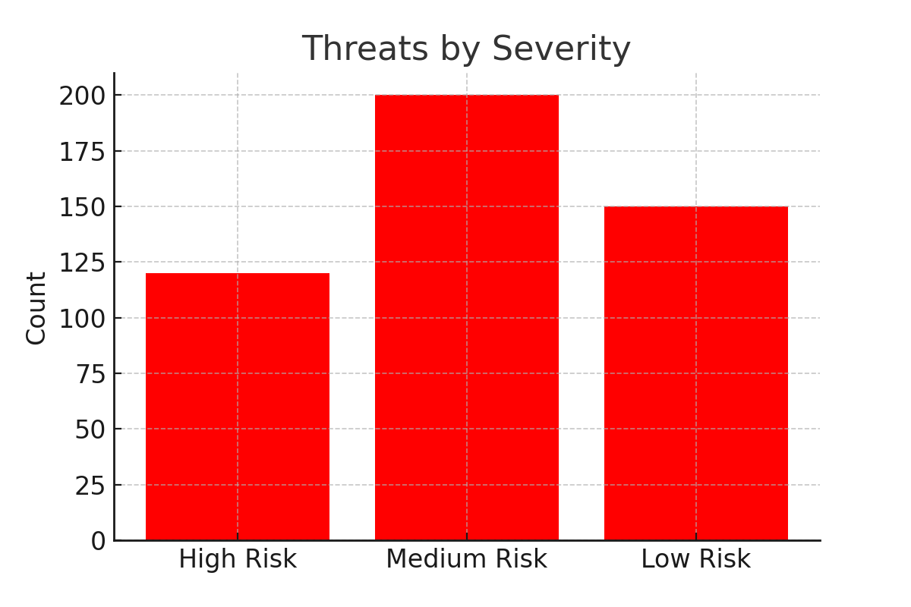
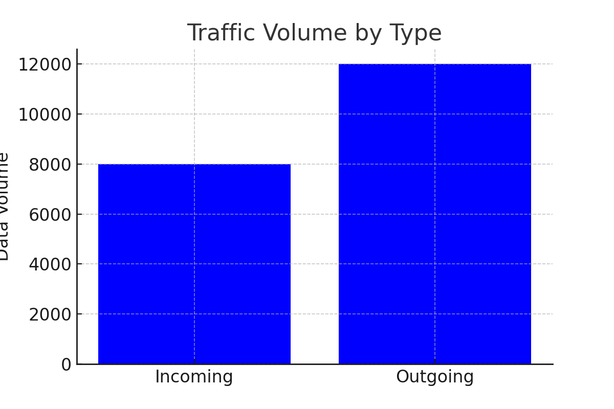
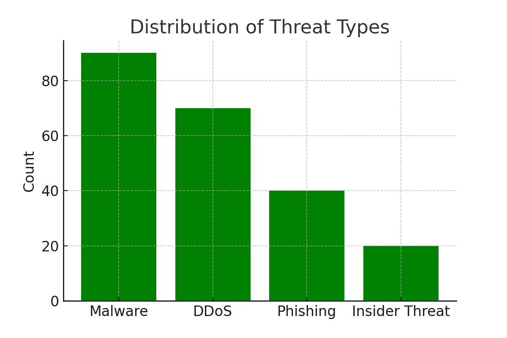
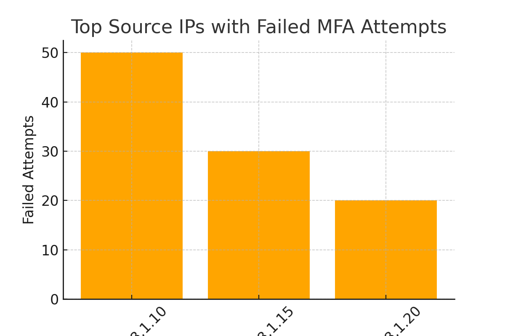
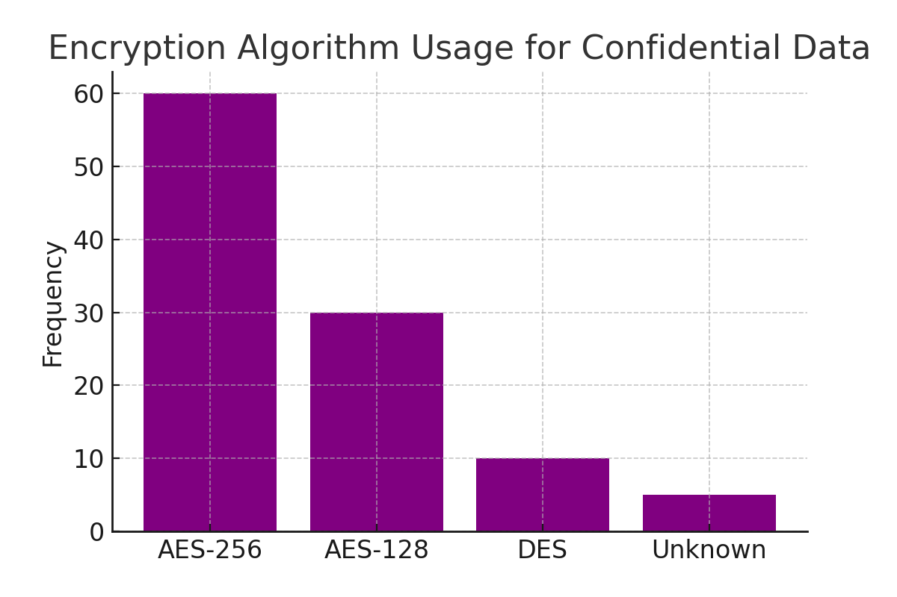
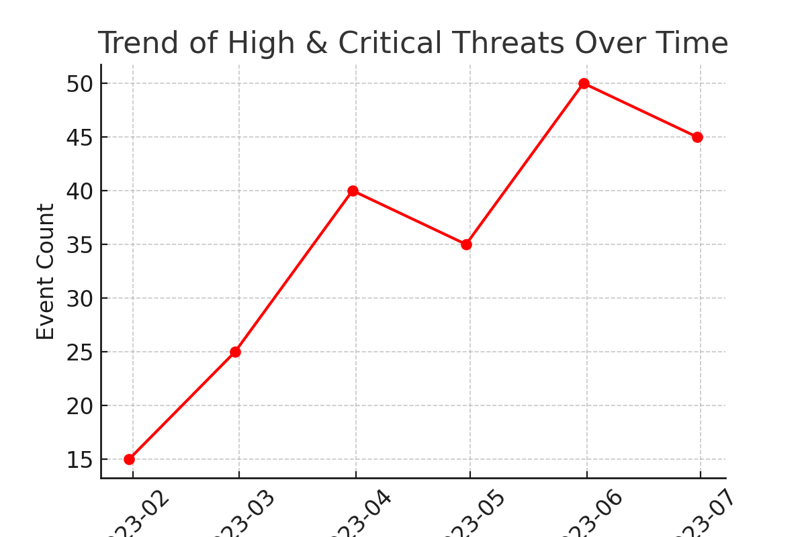

# Securing-the-Future: Cybersecurity-Risk-Analysis & Data-Protection-Strategies
This is a  market analysis, by way of EDA exploratory data analysis for an energy business looking for entry and exit strategies. 

# Cybersecurity Risk Analysis Project

## Table of Contents
1. [Project Overview](#project-overview)
2. [Threats by Severity](#threats-by-severity)
3. [Traffic Volume by Type](#traffic-volume-by-type)
4. [Distribution of Threat Types](#distribution-of-threat-types)
5. [Failed MFA Attempts](#failed-mfa-attempts)
6. [Encryption Algorithm Usage](#encryption-algorithm-usage)
7. [Trend of High & Critical Threats](#trend-of-high--critical-threats)
8. [Insights & Recommendations](#insights--recommendations)
9. [Conclusion](#conclusion)

---

## Project Overview
This project analyzes **LOCK Co.’s cybersecurity risks** using SQL queries and data visualization.  
It aims to detect vulnerabilities, assess threats, and provide actionable recommendations to protect sensitive data, ensure compliance, and maintain client trust.

**Context Screenshots**  
  
  
  
  


---

## Threats by Severity
**SQL Query:**【30†source】
```sql
-- Categorize and summarize severity levels
-- (Assumes Severity_Category already derived from Severity_Level)
SELECT 
    SUM(CASE WHEN Severity_Category = 'High Risk' THEN 1 ELSE 0 END) as High_Risk_Count,
    SUM(CASE WHEN Severity_Category = 'Low Risk' THEN 1 ELSE 0 END) as Low_Risk_Count,
    SUM(CASE WHEN Severity_Category = 'Medium Risk' THEN 1 ELSE 0 END) as Medium_Risk_Count
FROM network_logs_2;
```
**Visualization:**  


---

## Traffic Volume by Type
**SQL Query:**【30†source】
```sql
-- Total data volume across traffic categories
SELECT Traffic_Category, SUM(Data_Volume) as Total_Data_Volume 
FROM network_logs
GROUP BY Traffic_Category 
ORDER BY Total_Data_Volume DESC;
```
**Visualization:**  


---

## Distribution of Threat Types
**SQL Query:**【30†source】
```sql
-- Count events by threat type
SELECT B.Threat_Type, COUNT(*) as Threat_Count
FROM network_logs A
JOIN network_logs_2 B ON A.ID = B.Linked_ID
GROUP BY B.Threat_Type
ORDER BY Threat_Count DESC;
```
**Visualization:**  


---

## Failed MFA Attempts
**SQL Query:**【30†source】
```sql
-- Rank sources by failed MFA attempts
SELECT 
    Source_IP, 
    COUNT(ID) as Failed_Attempts
FROM network_logs
WHERE MFA_Status = 'Failed'
GROUP BY Source_IP
ORDER BY Failed_Attempts DESC;
```
**Visualization:**  


---

## Encryption Algorithm Usage
**SQL Query:**【30†source】
```sql
-- Frequency of encryption algorithms for sensitive data
SELECT A.Encryption_Algorithm, COUNT(*) as Frequency
FROM network_logs A
WHERE A.Data_Classification IN ('Confidential', 'Highly Confidential')
GROUP BY A.Encryption_Algorithm
ORDER BY Frequency DESC;
```
**Visualization:**  


---

## Trend of High & Critical Threats
**SQL Query:**【30†source】
```sql
-- Monthly trend of high/critical events
SELECT DATE_TRUNC('month', A.Timestamp) AS Month, COUNT(*) as Critical_High_Count
FROM network_logs A
JOIN network_logs_2 B ON A.ID = B.Linked_ID
WHERE B.Severity_Level IN ('High', 'Critical')
GROUP BY DATE_TRUNC('month', A.Timestamp)
ORDER BY Month;
```
**Visualization:**  


---

## Insights & Recommendations
### Key Insights
- **Severity:** Medium-risk threats are most frequent, with **high-risk events trending upward**.
- **Traffic:** **Outgoing traffic > Incoming**, suggesting potential **data exfiltration** vectors.
- **Threat Mix:** Malware and DDoS dominate event volume, with notable **phishing** presence.
- **Authentication:** **Failed MFA** attempts cluster around a few IPs → likely **targeted brute-force**.
- **Encryption:** Some confidential data uses **weak/unknown algorithms**, creating exposure.

### Recommendations (Actionable)
1. **Harden Authentication**: Enforce stricter MFA policies; implement rate-limiting and IP blacklisting; alert on abnormal login patterns.
2. **Standardize Encryption**: Mandate **AES-256** for all confidential/highly confidential data; audit and remediate “Unknown” algorithms.
3. **Monitor Exfiltration**: Deploy egress anomaly detection (DLP rules, sudden spikes, unusual destinations) and block suspicious flows.
4. **Bolster Endpoint & Network Security**: EDR + IDS/IPS tuning against **Malware/DDoS/Phishing** playbooks; sandbox suspicious payloads.
5. **Firewall Rule Hygiene**: Review high-trigger rules; convert noisy allows to **least-privilege** denies where feasible.
6. **Incident Response Readiness**: Establish runbooks for **High/Critical** events with defined RTO/RPO; run tabletop exercises quarterly.

**Operational KPIs to Track**
- Mean time to detect/respond (MTTD/MTTR) for high/critical incidents  
- % of confidential data covered by **AES-256**  
- MFA failure rate by source and **block rate** for repeated offenders  
- **Outbound** data volume anomalies (Z-score/Sigma rules)  
- Patch/EDR policy compliance rates

---

## Conclusion
This self-contained README ties **SQL evidence** to **visual outcomes** and a prescriptive plan.  
Executing the recommendations will reduce risk exposure, improve compliance, and strengthen client trust.
